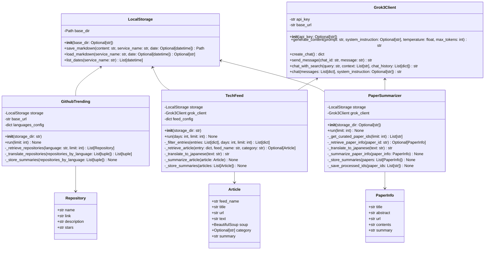
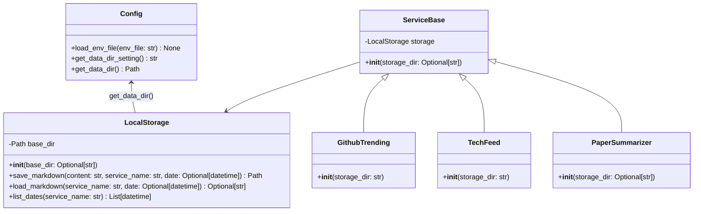
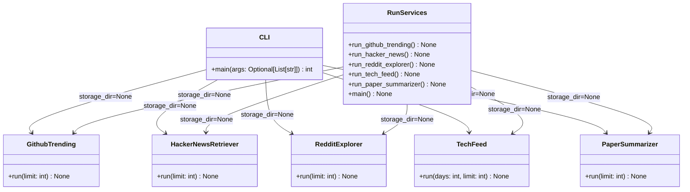

# Nook - クラス図

## 主要クラス構造

```mermaid
classDiagram
    class LocalStorage {
        -Path base_dir
        +__init__(base_dir: Optional[str])
        +save_markdown(content: str, service_name: str, date: Optional[datetime]) Path
        +load_markdown(service_name: str, date: Optional[datetime]) Optional[str]
        +list_dates(service_name: str) List[datetime]
    }

    class Grok3Client {
        -str api_key
        -str base_url
        +__init__(api_key: Optional[str])
        +generate_content(prompt: str, system_instruction: Optional[str], temperature: float, max_tokens: int) str
        +create_chat() dict
        +send_message(chat_id: str, message: str) str
        +chat_with_search(query: str, context: List[str], chat_history: List[dict]) str
        +chat(messages: List[dict], system_instruction: Optional[str]) str
    }

    class GithubTrending {
        -LocalStorage storage
        -str base_url
        -dict languages_config
        +__init__(storage_dir: str)
        +run(limit: int) None
        -_retrieve_repositories(language: str, limit: int) List[Repository]
        -_translate_repositories(repositories_by_language: List[tuple]) List[tuple]
        -_store_summaries(repositories_by_language: List[tuple]) None
    }

    class TechFeed {
        -LocalStorage storage
        -Grok3Client grok_client
        -dict feed_config
        +__init__(storage_dir: str)
        +run(days: int, limit: int) None
        -_filter_entries(entries: List[dict], days: int, limit: int) List[dict]
        -_retrieve_article(entry: dict, feed_name: str, category: str) Optional[Article]
        -_translate_to_japanese(text: str) str
        -_summarize_article(article: Article) None
        -_store_summaries(articles: List[Article]) None
    }

    class PaperSummarizer {
        -LocalStorage storage
        -Grok3Client grok_client
        +__init__(storage_dir: Optional[str])
        +run(limit: int) None
        -_get_curated_paper_ids(limit: int) List[str]
        -_retrieve_paper_info(paper_id: str) Optional[PaperInfo]
        -_translate_to_japanese(text: str) str
        -_summarize_paper_info(paper_info: PaperInfo) None
        -_store_summaries(papers: List[PaperInfo]) None
        -_save_processed_ids(paper_ids: List[str]) None
    }

    class Article {
        +str feed_name
        +str title
        +str url
        +str text
        +BeautifulSoup soup
        +Optional[str] category
        +str summary
    }

    class PaperInfo {
        +str title
        +str abstract
        +str url
        +str contents
        +str summary
    }

    class Repository {
        +str name
        +str link
        +str description
        +str stars
    }

    LocalStorage <-- GithubTrending
    LocalStorage <-- TechFeed
    LocalStorage <-- PaperSummarizer
    
    Grok3Client <-- TechFeed
    Grok3Client <-- PaperSummarizer
    
    GithubTrending --> Repository
    TechFeed --> Article
    PaperSummarizer --> PaperInfo
```

## 設定とストレージの関係

```mermaid
classDiagram
    class Config {
        +load_env_file(env_file: str) None
        +get_data_dir_setting() str
        +get_data_dir() Path
    }
    
    class LocalStorage {
        -Path base_dir
        +__init__(base_dir: Optional[str])
        +save_markdown(content: str, service_name: str, date: Optional[datetime]) Path
        +load_markdown(service_name: str, date: Optional[datetime]) Optional[str]
        +list_dates(service_name: str) List[datetime]
    }
    
    class ServiceBase {
        -LocalStorage storage
        +__init__(storage_dir: Optional[str])
    }
    
    class GithubTrending {
        +__init__(storage_dir: str)
    }
    
    class TechFeed {
        +__init__(storage_dir: str)
    }
    
    class PaperSummarizer {
        +__init__(storage_dir: Optional[str])
    }
    
    Config <-- LocalStorage : get_data_dir()
    ServiceBase <|-- GithubTrending
    ServiceBase <|-- TechFeed
    ServiceBase <|-- PaperSummarizer
    ServiceBase --> LocalStorage
```

## 実行フローのクラス関係

```mermaid
classDiagram
    class CLI {
        +main(args: Optional[List[str]]) int
    }
    
    class RunServices {
        +run_github_trending() None
        +run_hacker_news() None
        +run_reddit_explorer() None
        +run_tech_feed() None
        +run_paper_summarizer() None
        +main() None
    }
    
    class GithubTrending {
        +run(limit: int) None
    }
    
    class HackerNewsRetriever {
        +run(limit: int) None
    }
    
    class RedditExplorer {
        +run(limit: int) None
    }
    
    class TechFeed {
        +run(days: int, limit: int) None
    }
    
    class PaperSummarizer {
        +run(limit: int) None
    }
    
    CLI --> GithubTrending : storage_dir=None
    CLI --> HackerNewsRetriever : storage_dir=None
    CLI --> RedditExplorer : storage_dir=None
    CLI --> TechFeed : storage_dir=None
    CLI --> PaperSummarizer : storage_dir=None
    
    RunServices --> GithubTrending : storage_dir=None
    RunServices --> HackerNewsRetriever : storage_dir=None
    RunServices --> RedditExplorer : storage_dir=None
    RunServices --> TechFeed : storage_dir=None
    RunServices --> PaperSummarizer : storage_dir=None
``` 