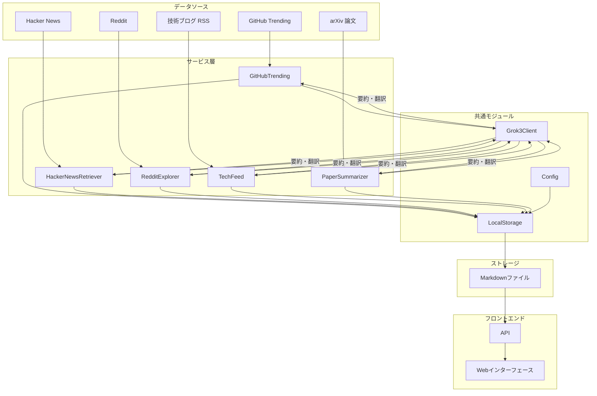
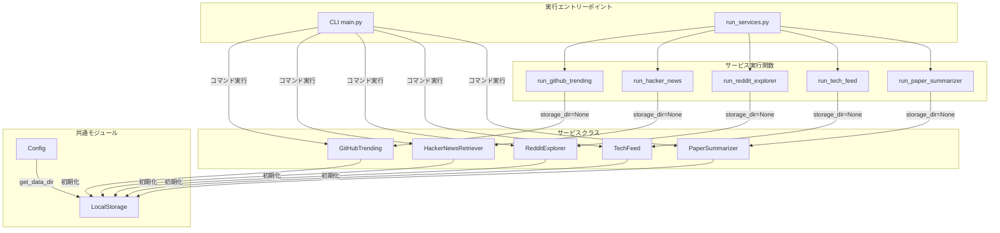
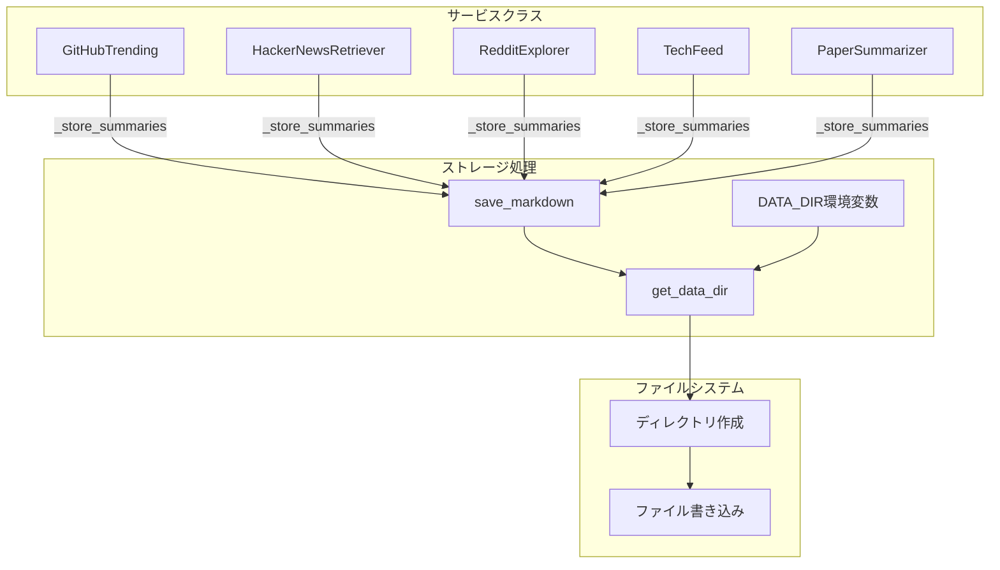

# Nook - フローチャート図

## データ収集・処理フロー

```mermaid
flowchart TD
    subgraph "データソース"
        GH[GitHub Trending]
        HN[Hacker News]
        RD[Reddit]
        TF[技術ブログ RSS]
        AX[arXiv 論文]
    end

    subgraph "サービス層"
        GHS[GitHubTrending]
        HNS[HackerNewsRetriever]
        RDS[RedditExplorer]
        TFS[TechFeed]
        AXS[PaperSummarizer]
    end

    subgraph "共通モジュール"
        GC[Grok3Client]
        LS[LocalStorage]
        CF[Config]
    end

    subgraph "ストレージ"
        MD[Markdownファイル]
    end

    subgraph "フロントエンド"
        API[API]
        UI[Webインターフェース]
    end

    GH --> GHS
    HN --> HNS
    RD --> RDS
    TF --> TFS
    AX --> AXS

    GHS --> GC
    HNS --> GC
    RDS --> GC
    TFS --> GC
    AXS --> GC

    GC --> |要約・翻訳| GHS
    GC --> |要約・翻訳| HNS
    GC --> |要約・翻訳| RDS
    GC --> |要約・翻訳| TFS
    GC --> |要約・翻訳| AXS

    GHS --> LS
    HNS --> LS
    RDS --> LS
    TFS --> LS
    AXS --> LS

    CF --> LS
    LS --> MD

    MD --> API
    API --> UI
```

## サービス実行フロー

```mermaid
flowchart TD
    subgraph "実行エントリーポイント"
        CLI[CLI main.py]
        RUN[run_services.py]
    end

    subgraph "サービス実行関数"
        RGH[run_github_trending]
        RHN[run_hacker_news]
        RRD[run_reddit_explorer]
        RTF[run_tech_feed]
        RAX[run_paper_summarizer]
    end

    subgraph "サービスクラス"
        GHS[GitHubTrending]
        HNS[HackerNewsRetriever]
        RDS[RedditExplorer]
        TFS[TechFeed]
        AXS[PaperSummarizer]
    end

    subgraph "共通モジュール"
        LS[LocalStorage]
        CF[Config]
    end

    CLI --> |コマンド実行| GHS
    CLI --> |コマンド実行| HNS
    CLI --> |コマンド実行| RDS
    CLI --> |コマンド実行| TFS
    CLI --> |コマンド実行| AXS

    RUN --> RGH
    RUN --> RHN
    RUN --> RRD
    RUN --> RTF
    RUN --> RAX

    RGH --> |storage_dir=None| GHS
    RHN --> |storage_dir=None| HNS
    RRD --> |storage_dir=None| RDS
    RTF --> |storage_dir=None| TFS
    RAX --> |storage_dir=None| AXS

    GHS --> |初期化| LS
    HNS --> |初期化| LS
    RDS --> |初期化| LS
    TFS --> |初期化| LS
    AXS --> |初期化| LS

    CF --> |get_data_dir| LS
```

## データ保存フロー

```mermaid
flowchart TD
    subgraph "サービスクラス"
        GHS[GitHubTrending]
        HNS[HackerNewsRetriever]
        RDS[RedditExplorer]
        TFS[TechFeed]
        AXS[PaperSummarizer]
    end

    subgraph "ストレージ処理"
        SM[save_markdown]
        DD[get_data_dir]
        ENV[DATA_DIR環境変数]
    end

    subgraph "ファイルシステム"
        DIR[ディレクトリ作成]
        FILE[ファイル書き込み]
    end

    GHS --> |_store_summaries| SM
    HNS --> |_store_summaries| SM
    RDS --> |_store_summaries| SM
    TFS --> |_store_summaries| SM
    AXS --> |_store_summaries| SM

    SM --> DD
    ENV --> DD
    DD --> DIR
    DIR --> FILE
``` 